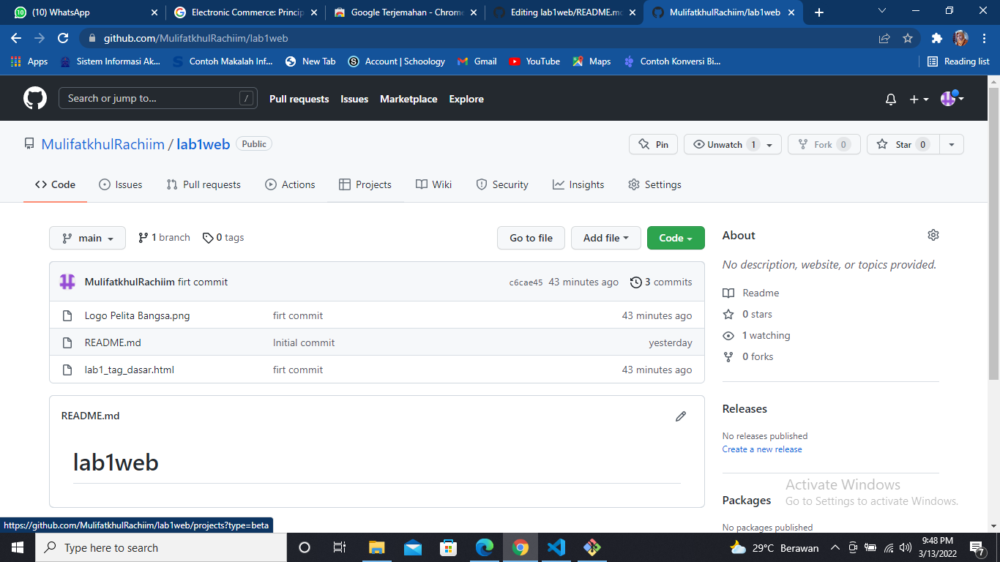
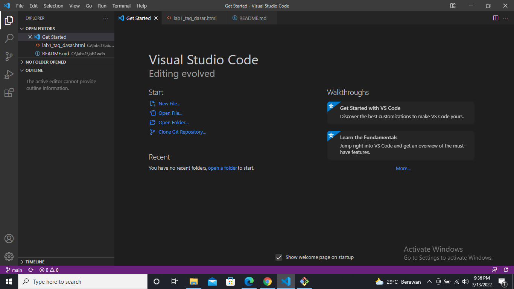
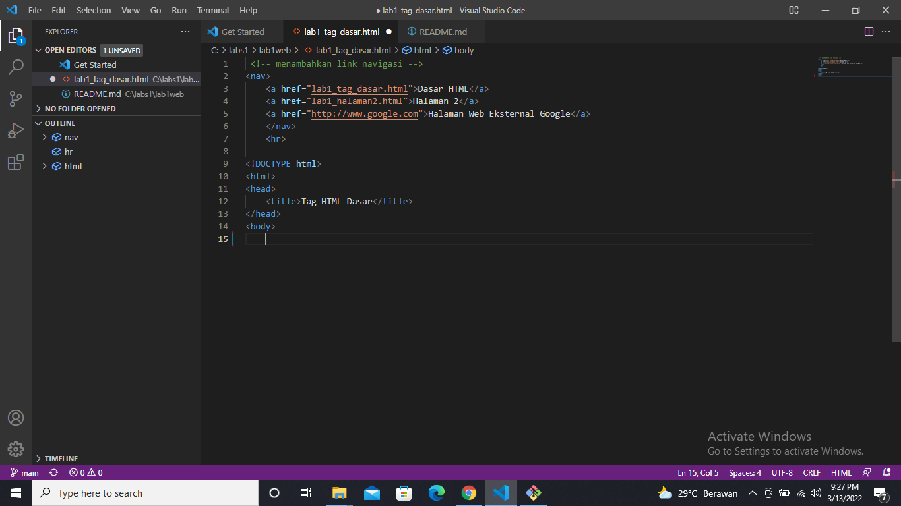
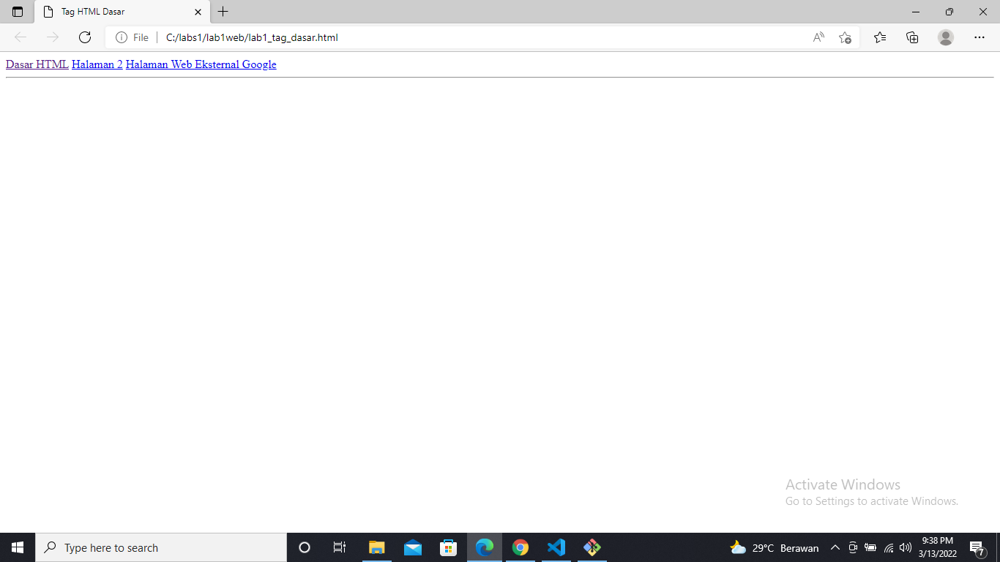
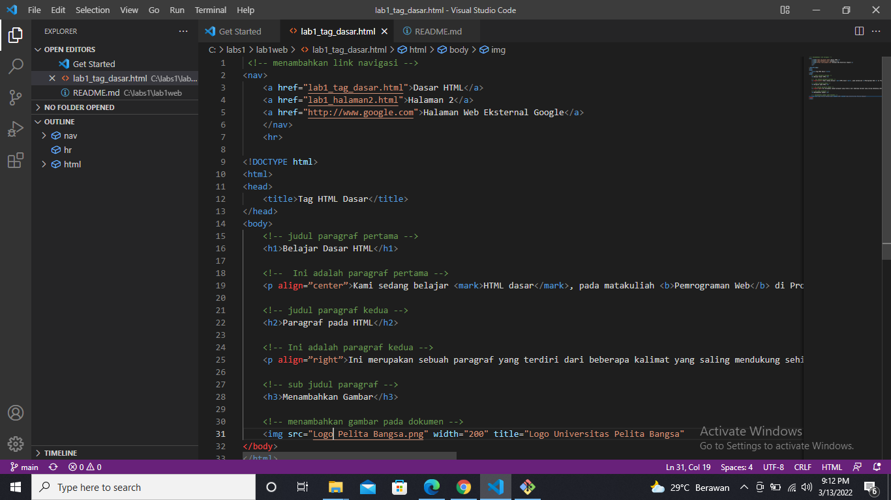
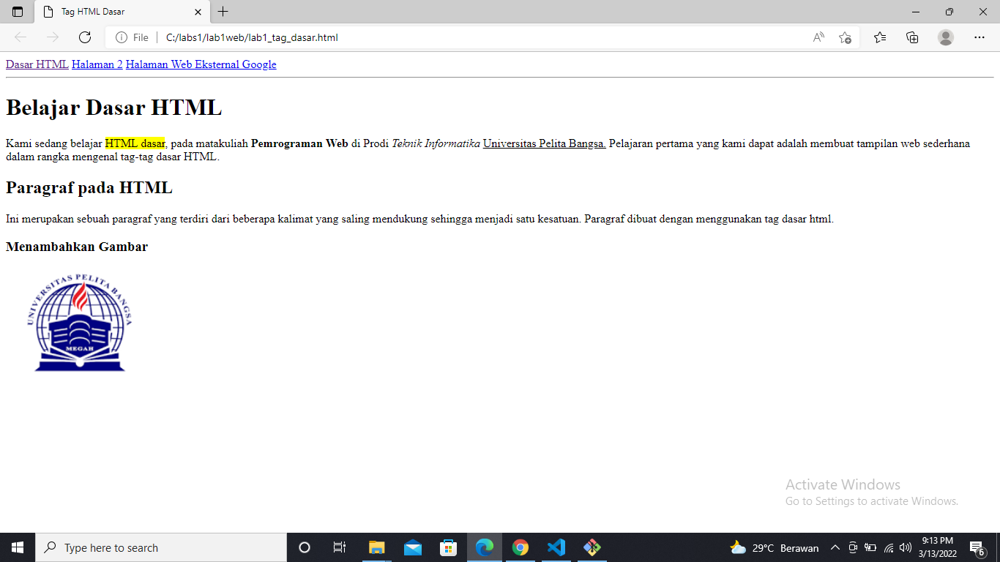

# PRATIKUM PEMROGRAMAN WEB
Tugas ini di buat untuk memenuhi tugas pertemuan kedua

Nama  : Mulifatkhul Rachiim

NIM   : 312010180

Kelas : TI.20.B1

# LANGKAH - LANGKAH MEMBUAT PROGRAM HTML

1. Buatlah repository baru dengan nama Lab1Web

2. Persiapkan text editor misalnya VSCode

3. Buat file baru dengan nama lab1_tag_dasar.html dan membuat struktur dasar dari dokumen HTML.

4. Kemudian selanjutnya, buka file tersebut pada web browser 

5. selanjutnya membuat beberapa paragraf sesuai pratikum 1 dan cara menambahkan hyperlink kemudian di save

![screenshot (21).png](sc

6. setelah di save buka file tersebut pada web browser

7. selanjutnya 

